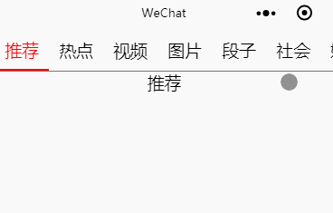
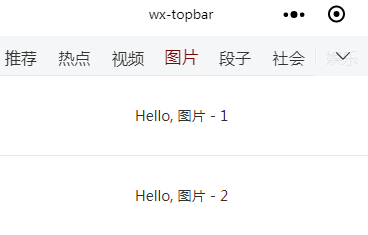
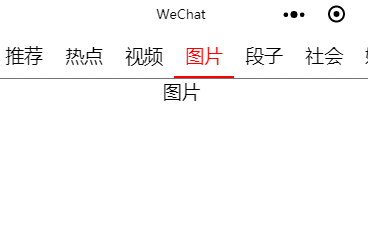

# 仿今日头条的滚动栏的微信小程序
### 我搜索了网上源码，发现有两种实现方式，尽可能的减少不必要的变量，仿写了一下
### 先上个效果图，两种方式实现的效果其实是一样的

### 核心数据
- 核心的驱动数据是currentTab，上下两部分都根据这个数据进行切换
### 顶部切换设置
- 顶部的滚动，我使用的是flex布局，原本flex后view长度是100%和屏幕一样宽，所以使用width:fit-content,根据内容撑开view
- 顶部左右滚动过程中，如果栏目标题不在屏幕内，则移动一格使其进入屏幕，原本的判断方法是通过判断栏目是第几个进行左右移动，这样的可以实现效果，但有个小bug，当不在屏幕内的栏目标题，滑动下面内容部分使其进入屏幕之前，手动滑动顶部的栏目，使其出现在屏幕内，此时再滑动下面内容部分，会有一个跳动，使栏目标题在固定的右边第二个  

- 因为其方法是判断该栏目是第几个，如果是超过屏幕的栏目，则移动固定的距离，所以会有跳动，使其在固定位置
- ### 小改进
    - 获取顶部sroll-view下面的栏目标题变红的dom位置，如果小于0，则右移，如果超过屏幕宽度，则左移，此时手动滑动顶部栏目，再滑动下面部分，不会出现顶部栏目跳动的bug  
    
    - 小细节，是在修改标题栏变红后，获取该dom的位置

### 内容部分
### 1. swiper方式
- 通过currentTab和顶部栏目进行联动即可
### 2. scroll-view方式
- 通过手指滑动事件，获取到坐标，进行前后对比，得出左滑还是右滑，修改currentTab进行联动即可
### 思考
- 如何实现懒加载？
    - 目前的思路是当切换的时候，获取到currentTab，此时访问后端获取数据，再进行绑定显示
### 仿写思路教程
- 首先将wxml和wxss复制过去，实现上下均可滚动效果
- 之后进行顶部栏目滚动的函数的绑定
- 进一步设计下面内容部分滚动
- 上下的滚动都由currentTab一个数据驱动，所以实现了联动
### 参考教程，表示感谢
[参考教程1](https://blog.csdn.net/qq_31383345/article/details/52900835)
[参考教程2](https://www.jianshu.com/p/fe5756b541d8)
